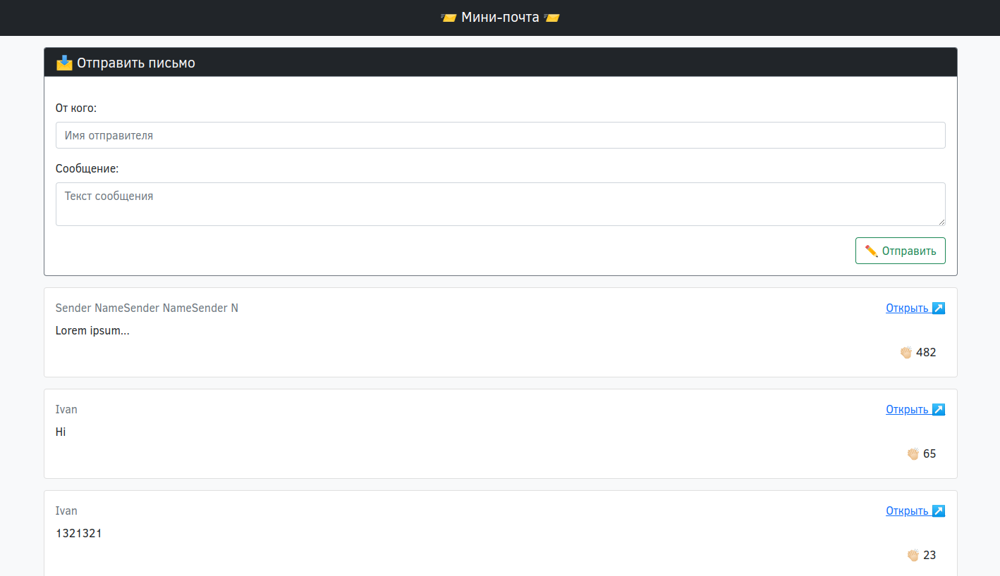

# Minimail

Simple message board with claps from users.



## Run and test

1. Start all services:

    ```shell
    docker compose up
    ```

    or

    ```shell
    docker-compose up
    ```

2. Open page in browser:
   - Swagger UI: http://localhost:8080/swagger/
   - Templates client: http://localhost:8080/templates/
   - AJAX client: http://localhost:8080/ajax/
   - SPA client: http://localhost:3000/

## Project structure

- `server` - backend written in Go that both provides HTTP API and serves files for GUI clients.
- `client-swagger-ui` - client provided by Swagger; served by `server`.
- `client-templates` - client based on server templates; served by `server`.
- `client-ajax` - client based on AJAX; served by `server`
- `client-spa` - SPA written in TypeScript using React; served by `serve` package.
- `client-common` - common files for two or more other clients (bootstrap CSS file).
- `docs` - files related to documentation (images).

## External services

- `postgres` - used for storing data (messages, claps).
